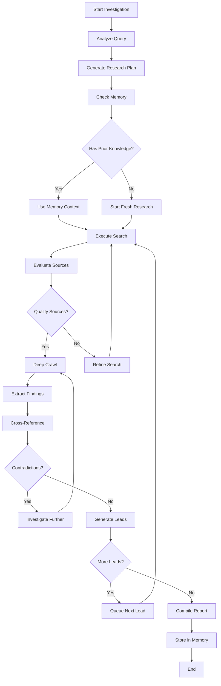

# IntelliScope Agent Architecture

## Agent Framework Stack

```typescript
// Core Agent Framework
- LangGraph: State machine and workflow orchestration
- LangChain: Tool integration and prompt management
- Custom MCP Servers: Tool execution layer
- Mem0: Long-term memory and learning
- llama with groq: Reasoning and decision making
```

## Agent State Machine

```typescript
// Agent State Definition
interface InvestigationState {
  investigation_id: string
  query: string
  context: string[]
  leads: Lead[]
  sources: Source[]
  findings: Finding[]
  next_actions: string[]
  confidence_score: number
  human_input_required: boolean
}
```

## Agent Workflow Graph



## Core Agent Implementation

```typescript
// lib/agents/investigation-agent.ts
import { StateGraph, END } from "@langchain/langgraph"
import { BaseMessage } from "@langchain/core/messages"
import { InvestigationMemory } from "../mem0"
import { TavilyMCP } from "../mcp/tavily-server"

interface AgentState {
  messages: BaseMessage[]
  investigation_id: string
  current_query: string
  context: string[]
  leads: any[]
  sources: any[]
  findings: any[]
  next_action: string
  confidence: number
}

export class InvestigationAgent {
  private graph: StateGraph
  private memory: InvestigationMemory
  private tavily: TavilyMCP
  
  constructor() {
    this.memory = new InvestigationMemory()
    this.tavily = new TavilyMCP()
    this.buildGraph()
  }
  
  private buildGraph() {
    const workflow = new StateGraph({
      channels: {
        messages: [],
        investigation_id: "",
        current_query: "",
        context: [],
        leads: [],
        sources: [],
        findings: [],
        next_action: "",
        confidence: 0
      }
    })
    
    // Add nodes (agent thinking steps)
    workflow.addNode("analyzer", this.analyzeQuery.bind(this))
    workflow.addNode("planner", this.generatePlan.bind(this))
    workflow.addNode("memory_check", this.checkMemory.bind(this))
    workflow.addNode("researcher", this.executeResearch.bind(this))
    workflow.addNode("evaluator", this.evaluateSources.bind(this))
    workflow.addNode("crawler", this.deepCrawl.bind(this))
    workflow.addNode("extractor", this.extractFindings.bind(this))
    workflow.addNode("validator", this.validateFindings.bind(this))
    workflow.addNode("lead_generator", this.generateLeads.bind(this))
    workflow.addNode("reporter", this.compileReport.bind(this))
    workflow.addNode("learner", this.updateMemory.bind(this))
    
    // Define the flow
    workflow.addEdge("analyzer", "planner")
    workflow.addEdge("planner", "memory_check")
    workflow.addConditionalEdges(
      "memory_check",
      this.shouldUseMemory,
      {
        "use_memory": "researcher",
        "fresh_start": "researcher"
      }
    )
    workflow.addEdge("researcher", "evaluator")
    workflow.addConditionalEdges(
      "evaluator",
      this.shouldCrawl,
      {
        "crawl": "crawler",
        "refine_search": "researcher",
        "insufficient": "lead_generator"
      }
    )
    workflow.addEdge("crawler", "extractor")
    workflow.addEdge("extractor", "validator")
    workflow.addConditionalEdges(
      "validator",
      this.shouldContinue,
      {
        "investigate_further": "researcher",
        "generate_leads": "lead_generator",
        "compile_report": "reporter"
      }
    )
    workflow.addEdge("lead_generator", "researcher")
    workflow.addEdge("reporter", "learner")
    workflow.addEdge("learner", END)
    
    workflow.setEntryPoint("analyzer")
    this.graph = workflow.compile()
  }
  
  // Agent Thinking Steps
  
  async analyzeQuery(state: AgentState): Promise<AgentState> {
    console.log("🤔 Agent thinking: Analyzing the query...")
    
    const analysis = await this.llm.invoke([
      {
        role: "system",
        content: `You are an expert investigator. Analyze this query and determine:
        1. What type of investigation this is
        2. Key entities to research
        3. Potential challenges
        4. Information sources to prioritize`
      },
      {
        role: "user",
        content: state.current_query
      }
    ])
    
    return {
      ...state,
      context: [...state.context, analysis.content],
      next_action: "generate_plan"
    }
  }
  
  async generatePlan(state: AgentState): Promise<AgentState> {
    console.log("📋 Agent thinking: Creating research plan...")
    
    const plan = await this.llm.invoke([
      {
        role: "system",
        content: `Create a strategic research plan. Break down the investigation into specific, actionable research questions.`
      },
      {
        role: "user",
        content: `Query: ${state.current_query}\nAnalysis: ${state.context.join('\n')}`
      }
    ])
    
    // Parse the plan into actionable leads
    const leads = this.parsePlanIntoLeads(plan.content)
    
    return {
      ...state,
      leads: leads,
      next_action: "check_memory"
    }
  }
  
  async checkMemory(state: AgentState): Promise<AgentState> {
    console.log("🧠 Agent thinking: Checking what I already know...")
    
    // Query Mem0 for relevant past investigations
    const memories = await this.memory.searchMemories(
      state.current_query,
      state.investigation_id
    )
    
    const relevantContext = memories.filter(m => m.score > 0.7)
    
    return {
      ...state,
      context: [...state.context, ...relevantContext.map(m => m.text)],
      confidence: relevantContext.length > 0 ? 0.3 : 0.1
    }
  }
  
  async executeResearch(state: AgentState): Promise<AgentState> {
    console.log("🔍 Agent thinking: Searching for information...")
    
    const currentLead = state.leads[0] // Process first lead
    
    // Use Tavily MCP for intelligent search
    const searchResults = await this.tavily.search({
      query: currentLead.query,
      search_depth: "advanced",
      max_results: 10
    })
    
    return {
      ...state,
      sources: [...state.sources, ...searchResults],
      next_action: "evaluate_sources"
    }
  }
  
  async evaluateSources(state: AgentState): Promise<AgentState> {
    console.log("⚖️ Agent thinking: Evaluating source quality...")
    
    const evaluation = await this.llm.invoke([
      {
        role: "system",
        content: `Evaluate these sources for:
        1. Credibility and reliability
        2. Relevance to the investigation
        3. Information density
        4. Potential for deeper insights
        
        Return a JSON array with scores and reasoning.`
      },
      {
        role: "user",
        content: JSON.stringify(state.sources.slice(-10)) // Last 10 sources
      }
    ])
    
    const scores = JSON.parse(evaluation.content)
    const highQualitySources = scores.filter(s => s.score > 0.7)
    
    return {
      ...state,
      confidence: state.confidence + (highQualitySources.length * 0.1),
      next_action: highQualitySources.length > 0 ? "crawl" : "refine_search"
    }
  }
  
  async deepCrawl(state: AgentState): Promise<AgentState> {
    console.log("🕷️ Agent thinking: Deep crawling promising sources...")
    
    // Get top 5 sources for deep crawling
    const topSources = state.sources
      .sort((a, b) => b.score - a.score)
      .slice(0, 5)
    
    const crawlResults = await Promise.all(
      topSources.map(source => 
        this.tavily.crawl({
          url: source.url,
          max_depth: 2,
          extract_content: true
        })
      )
    )
    
    return {
      ...state,
      sources: [...state.sources, ...crawlResults.flat()],
      next_action: "extract_findings"
    }
  }
  
  async extractFindings(state: AgentState): Promise<AgentState> {
    console.log("💎 Agent thinking: Extracting key findings...")
    
    const extraction = await this.llm.invoke([
      {
        role: "system",
        content: `Extract key findings from these sources. Focus on:
        1. Facts and evidence
        2. Relationships and connections
        3. Timeline events
        4. Contradictions or gaps
        
        Structure as JSON with confidence scores.`
      },
      {
        role: "user",
        content: JSON.stringify(state.sources.slice(-20)) // Recent sources
      }
    ])
    
    const findings = JSON.parse(extraction.content)
    
    return {
      ...state,
      findings: [...state.findings, ...findings],
      confidence: state.confidence + 0.2,
      next_action: "validate_findings"
    }
  }
  
  async validateFindings(state: AgentState): Promise<AgentState> {
    console.log("✅ Agent thinking: Cross-referencing and validating...")
    
    const validation = await this.llm.invoke([
      {
        role: "system",
        content: `Cross-reference these findings for consistency and identify:
        1. Contradictions that need investigation
        2. Well-supported facts
        3. Areas needing more research
        4. Potential leads for deeper investigation`
      },
      {
        role: "user",
        content: JSON.stringify(state.findings)
      }
    ])
    
    const validationResult = JSON.parse(validation.content)
    
    // Determine next action based on validation
    let nextAction = "compile_report"
    if (validationResult.contradictions.length > 0) {
      nextAction = "investigate_further"
    } else if (validationResult.research_gaps.length > 0) {
      nextAction = "generate_leads"
    }
    
    return {
      ...state,
      context: [...state.context, validation.content],
      next_action: nextAction,
      confidence: validationResult.confidence_score
    }
  }
  
  async generateLeads(state: AgentState): Promise<AgentState> {
    console.log("🎯 Agent thinking: Generating new research leads...")
    
    const leadGeneration = await this.llm.invoke([
      {
        role: "system",
        content: `Based on current findings, generate specific follow-up research questions that could uncover more information or resolve contradictions.`
      },
      {
        role: "user",
        content: `Current findings: ${JSON.stringify(state.findings)}`
      }
    ])
    
    const newLeads = this.parseLeads(leadGeneration.content)
    
    return {
      ...state,
      leads: [...state.leads.slice(1), ...newLeads], // Remove processed lead, add new ones
      next_action: state.leads.length > 1 ? "research" : "compile_report"
    }
  }
  
  async compileReport(state: AgentState): Promise<AgentState> {
    console.log("📊 Agent thinking: Compiling final report...")
    
    const report = await this.llm.invoke([
      {
        role: "system",
        content: `Compile a comprehensive investigation report with:
        1. Executive summary
        2. Key findings with evidence
        3. Timeline of events
        4. Source analysis
        5. Confidence levels
        6. Recommendations for further investigation`
      },
      {
        role: "user",
        content: JSON.stringify({
          query: state.current_query,
          findings: state.findings,
          sources: state.sources.length,
          confidence: state.confidence
        })
      }
    ])
    
    return {
      ...state,
      findings: [...state.findings, {
        type: "final_report",
        content: report.content,
        confidence: state.confidence
      }],
      next_action: "update_memory"
    }
  }
  
  async updateMemory(state: AgentState): Promise<AgentState> {
    console.log("💾 Agent thinking: Learning from this investigation...")
    
    // Store investigation patterns and outcomes in Mem0
    await this.memory.addInvestigationMemory(
      state.investigation_id,
      {
        query: state.current_query,
        successful_strategies: this.extractSuccessfulStrategies(state),
        source_quality_patterns: this.analyzeSourcePatterns(state.sources),
        findings: state.findings,
        confidence: state.confidence
      }
    )
    
    console.log("✅ Investigation complete! I've learned from this experience.")
    
    return {
      ...state,
      next_action: "complete"
    }
  }
  
  // Decision Functions
  
  shouldUseMemory(state: AgentState): string {
    return state.context.length > 1 ? "use_memory" : "fresh_start"
  }
  
  shouldCrawl(state: AgentState): string {
    const recentSources = state.sources.slice(-10)
    const highQualitySources = recentSources.filter(s => s.score > 0.7)
    
    if (highQualitySources.length >= 3) return "crawl"
    if (recentSources.length < 5) return "refine_search"
    return "insufficient"
  }
  
  shouldContinue(state: AgentState): string {
    if (state.confidence < 0.6) return "investigate_further"
    if (state.leads.length > 1) return "generate_leads"
    return "compile_report"
  }
  
  // Public API
  
  async investigate(query: string, investigationId: string): Promise<any> {
    console.log(`🚀 Starting investigation: "${query}"`)
    
    const initialState: AgentState = {
      messages: [],
      investigation_id: investigationId,
      current_query: query,
      context: [],
      leads: [],
      sources: [],
      findings: [],
      next_action: "analyze",
      confidence: 0
    }
    
    const result = await this.graph.invoke(initialState)
    
    console.log(`✅ Investigation complete with ${result.confidence}% confidence`)
    
    return result
  }
}
```

## Agent-UI Integration

```typescript
// Frontend integration with the agent
import { useQuery, useMutation } from '@tanstack/react-query'

export function useInvestigationAgent() {
  const startInvestigation = useMutation({
    mutationFn: async ({ query, investigationId }: { query: string, investigationId: string }) => {
      const response = await fetch('/api/agent/investigate', {
        method: 'POST',
        headers: { 'Content-Type': 'application/json' },
        body: JSON.stringify({ query, investigationId })
      })
      return response.json()
    }
  })
  
  const subscribeToProgress = (investigationId: string) => {
    return new EventSource(`/api/agent/progress/${investigationId}`)
  }
  
  return {
    startInvestigation,
    subscribeToProgress
  }
}

// Real-time agent progress component
export function AgentProgressIndicator({ investigationId }: { investigationId: string }) {
  const [progress, setProgress] = useState<AgentProgress>()
  
  useEffect(() => {
    const eventSource = new EventSource(`/api/agent/progress/${investigationId}`)
    
    eventSource.onmessage = (event) => {
      const data = JSON.parse(event.data)
      setProgress(data)
    }
    
    return () => eventSource.close()
  }, [investigationId])
  
  return (
    <Card>
      <CardHeader>
        <CardTitle className="flex items-center gap-2">
          <Brain className="animate-pulse" />
          AI Agent Working...
        </CardTitle>
      </CardHeader>
      <CardContent>
        <div className="space-y-3">
          <div className="flex items-center gap-2">
            <Loader2 className="animate-spin h-4 w-4" />
            <span>{progress?.current_step || 'Initializing...'}</span>
          </div>
          
          <Progress value={progress?.completion_percentage || 0} />
          
          <div className="text-sm text-muted-foreground">
            Sources found: {progress?.sources_count || 0} | 
            Confidence: {progress?.confidence || 0}%
          </div>
          
          {progress?.findings && (
            <div className="mt-4">
              <h4 className="font-medium mb-2">Latest Findings:</h4>
              <ul className="space-y-1 text-sm">
                {progress.findings.slice(-3).map((finding, i) => (
                  <li key={i} className="flex items-start gap-2">
                    <CheckCircle className="h-4 w-4 text-green-500 mt-0.5" />
                    {finding.summary}
                  </li>
                ))}
              </ul>
            </div>
          )}
        </div>
      </CardContent>
    </Card>
  )
}
```

## MCP Server Integration

```typescript
// Custom MCP servers for tool execution
export class InvestigationMCPServer {
  async execute(tool: string, params: any) {
    switch (tool) {
      case 'tavily_search':
        return await this.tavilySearch(params)
      case 'tavily_crawl':
        return await this.tavilyCrawl(params)
      case 'mem0_query':
        return await this.mem0Query(params)
      case 'appwrite_store':
        return await this.appwriteStore(params)
      default:
        throw new Error(`Unknown tool: ${tool}`)
    }
  }
  
  private async tavilySearch(params: any) {
    // Advanced search with context awareness
    return await this.tavily.search({
      query: params.query,
      search_depth: 'advanced',
      include_domains: params.trusted_domains,
      exclude_domains: params.blocked_domains,
      max_results: params.max_results || 10
    })
  }
  
  private async tavilyCrawl(params: any) {
    // Intelligent crawling with rate limiting
    return await this.tavily.crawl({
      urls: params.urls,
      max_depth: params.depth || 2,
      respect_robots_txt: true,
      extract_content: true,
      follow_links: params.follow_links || false
    })
  }
}
```

## Agent Reasoning Display

```typescript
// Show the agent's thinking process to users
export function AgentThinkingDisplay({ thoughts }: { thoughts: AgentThought[] }) {
  return (
    <div className="space-y-4">
      {thoughts.map((thought, i) => (
        <div key={i} className="border-l-2 border-blue-500 pl-4">
          <div className="flex items-center gap-2 mb-2">
            <Brain className="h-4 w-4 text-blue-500" />
            <span className="font-medium">{thought.step}</span>
            <Badge variant={thought.confidence > 0.7 ? 'default' : 'secondary'}>
              {Math.round(thought.confidence * 100)}% confident
            </Badge>
          </div>
          <p className="text-sm text-muted-foreground">{thought.reasoning}</p>
          {thought.action && (
            <div className="mt-2 text-xs bg-muted p-2 rounded">
              Action: {thought.action}
            </div>
          )}
        </div>
      ))}
    </div>
  )
}
```