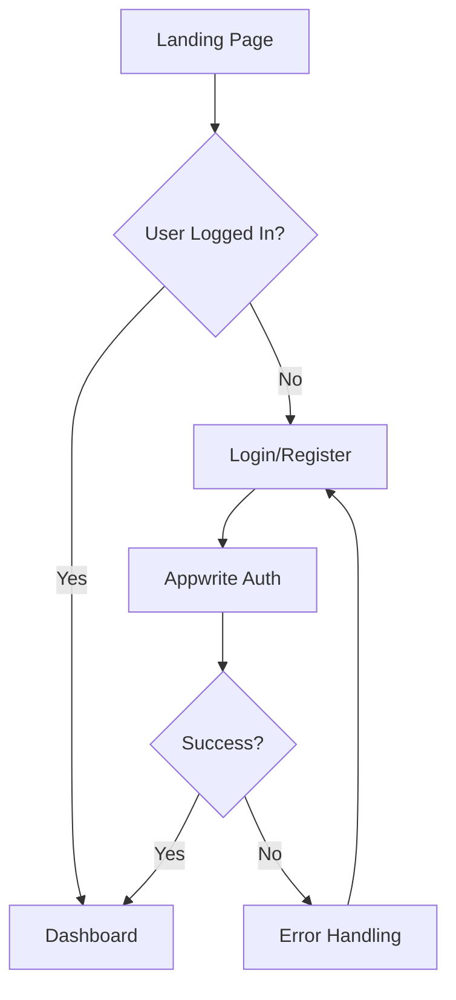
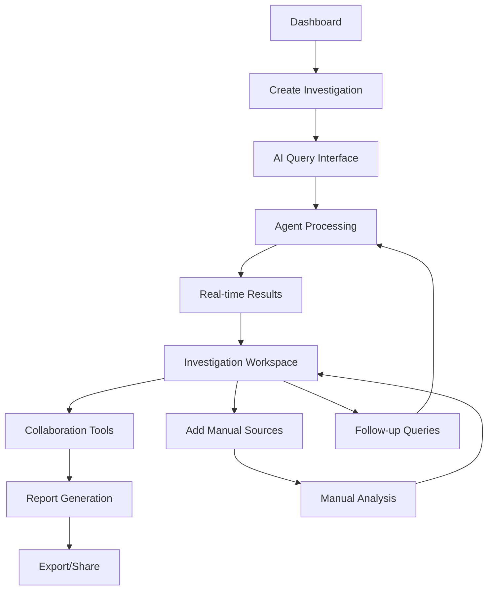
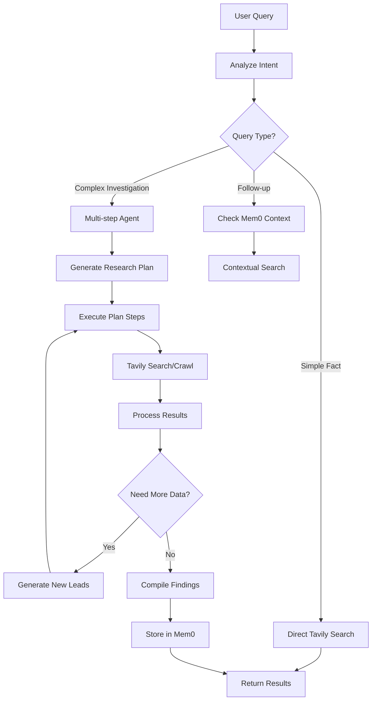

# IntelliScope: Complete Application Architecture

## 🌊 User Journey & App Flow

### **Authentication Flow**


### **Investigation Lifecycle**


### **Agent Decision Tree**


## 🏗️ Complete Tech Stack

### **Frontend Stack**
```json
{
  "framework": "Next.js 14 (App Router)",
  "language": "TypeScript",
  "styling": "Tailwind CSS + shadcn/ui",
  "state": "Zustand (Global) + React Query (Server State)",
  "validation": "Zod",
  
  "graphs": "React Flow",
  "animations": "Framer Motion",
  "forms": "React Hook Form + Zod",
  "tables": "TanStack Table",
  "date": "date-fns",
  "icons": "Lucide React",
  "notifications": "Sonner",
  "deployment": "Vercel"
}
```

### **Backend Stack**
```json
{
  "database": "Appwrite Database",
  "auth": "Appwrite Auth",
  "storage": "Appwrite Storage",
  "functions": "Appwrite Functions",
  "realtime": "Appwrite Realtime",
  "ai_search": "Tavily API (Direct)",
  "memory": "Mem0 API (Direct)",
  "agent_framework": "LangGraph + LangChain",
  "llm": "Claude-3.5-Sonnet / GPT-4",
  "mcp": "Custom MCP Servers (Optional Enhancement)",
  "monitoring": "Keywords AI",
  "email": "Resend",
  "webhooks": "Appwrite Webhooks"
}
```

### **Development Tools**
```json
{
  "package_manager": "bun",
  "code_quality": "ESLint + Prettier",
  
  "e2e": "Playwright",
  "type_checking": "TypeScript strict mode",
  "env": "Zod env validation",
  
 
}
```

## 📁 Complete Folder Structure

```
intelliscope/
├── 📁 .github/
│   └── workflows/
│       ├── ci.yml
│       └── deploy.yml
├── 📁 .next/
├── 📁 .vscode/
│   └── settings.json
├── 📁 docs/
│   ├── api.md
│   ├── deployment.md
│   └── agent-architecture.md
├── 📁 public/
│   ├── images/
│   ├── icons/
│   └── favicon.ico
├── 📁 src/
│   ├── 📁 app/                          # Next.js App Router
│   │   ├── 📁 (auth)/
│   │   │   ├── login/
│   │   │   │   └── page.tsx
│   │   │   ├── register/
│   │   │   │   └── page.tsx
│   │   │   └── layout.tsx
│   │   ├── 📁 (dashboard)/
│   │   │   ├── dashboard/
│   │   │   │   └── page.tsx
│   │   │   ├── investigations/
│   │   │   │   ├── [id]/
│   │   │   │   │   ├── page.tsx
│   │   │   │   │   ├── sources/
│   │   │   │   │   │   └── page.tsx
│   │   │   │   │   ├── timeline/
│   │   │   │   │   │   └── page.tsx
│   │   │   │   │   ├── network/
│   │   │   │   │   │   └── page.tsx
│   │   │   │   │   └── report/
│   │   │   │   │       └── page.tsx
│   │   │   │   ├── new/
│   │   │   │   │   └── page.tsx
│   │   │   │   └── page.tsx
│   │   │   ├── templates/
│   │   │   │   └── page.tsx
│   │   │   ├── settings/
│   │   │   │   └── page.tsx
│   │   │   └── layout.tsx
│   │   ├── 📁 api/                      # API Routes
│   │   │   ├── auth/
│   │   │   │   └── route.ts
│   │   │   ├── investigations/
│   │   │   │   ├── route.ts
│   │   │   │   └── [id]/
│   │   │   │       ├── route.ts
│   │   │   │       ├── sources/
│   │   │   │       │   └── route.ts
│   │   │   │       ├── leads/
│   │   │   │       │   └── route.ts
│   │   │   │       └── report/
│   │   │   │           └── route.ts
│   │   │   ├── agent/
│   │   │   │   ├── investigate/
│   │   │   │   │   └── route.ts
│   │   │   │   ├── progress/
│   │   │   │   │   └── [id]/
│   │   │   │   │       └── route.ts
│   │   │   │   └── chat/
│   │   │   │       └── route.ts
│   │   │   ├── tavily/
│   │   │   │   ├── search/
│   │   │   │   │   └── route.ts
│   │   │   │   └── crawl/
│   │   │   │       └── route.ts
│   │   │   ├── mem0/
│   │   │   │   ├── memories/
│   │   │   │   │   └── route.ts
│   │   │   │   └── search/
│   │   │   │       └── route.ts
│   │   │   ├── webhooks/
│   │   │   │   ├── appwrite/
│   │   │   │   │   └── route.ts
│   │   │   │   └── keywords-ai/
│   │   │   │       └── route.ts
│   │   │   └── export/
│   │   │       ├── pdf/
│   │   │       │   └── route.ts
│   │   │       └── csv/
│   │   │           └── route.ts
│   │   ├── globals.css
│   │   ├── layout.tsx
│   │   ├── page.tsx                     # Landing Page
│   │   ├── loading.tsx
│   │   ├── error.tsx
│   │   └── not-found.tsx
│   ├── 📁 components/                   # React Components
│   │   ├── 📁 ui/                       # shadcn/ui components
│   │   │   ├── button.tsx
│   │   │   ├── input.tsx
│   │   │   ├── card.tsx
│   │   │   ├── dialog.tsx
│   │   │   ├── table.tsx
│   │   │   ├── tabs.tsx
│   │   │   ├── progress.tsx
│   │   │   ├── badge.tsx
│   │   │   ├── separator.tsx
│   │   │   ├── skeleton.tsx
│   │   │   ├── toast.tsx
│   │   │   └── ...
│   │   ├── 📁 auth/
│   │   │   ├── LoginForm.tsx
│   │   │   ├── RegisterForm.tsx
│   │   │   ├── AuthProvider.tsx
│   │   │   └── ProtectedRoute.tsx
│   │   ├── 📁 dashboard/
│   │   │   ├── DashboardStats.tsx
│   │   │   ├── RecentInvestigations.tsx
│   │   │   ├── QuickActions.tsx
│   │   │   └── ActivityFeed.tsx
│   │   ├── 📁 investigation/
│   │   │   ├── 📁 creation/
│   │   │   │   ├── CreateInvestigationForm.tsx
│   │   │   │   ├── TemplateSelector.tsx
│   │   │   │   └── QueryBuilder.tsx
│   │   │   ├── 📁 workspace/
│   │   │   │   ├── InvestigationHeader.tsx
│   │   │   │   ├── NavigationTabs.tsx
│   │   │   │   ├── OverviewPanel.tsx
│   │   │   │   ├── SourcesPanel.tsx
│   │   │   │   ├── NetworkPanel.tsx
│   │   │   │   ├── TimelinePanel.tsx
│   │   │   │   └── ReportPanel.tsx
│   │   │   ├── 📁 sources/
│   │   │   │   ├── SourceList.tsx
│   │   │   │   ├── SourceCard.tsx
│   │   │   │   ├── SourceDetails.tsx
│   │   │   │   ├── CredibilityScore.tsx
│   │   │   │   └── AddSourceModal.tsx
│   │   │   ├── 📁 network/
│   │   │   │   ├── NetworkGraph.tsx
│   │   │   │   ├── NodeDetails.tsx
│   │   │   │   ├── GraphControls.tsx
│   │   │   │   └── FilterPanel.tsx
│   │   │   ├── 📁 timeline/
│   │   │   │   ├── TimelineView.tsx
│   │   │   │   ├── TimelineEvent.tsx
│   │   │   │   ├── AddEventModal.tsx
│   │   │   │   └── TimelineFilters.tsx
│   │   │   └── 📁 collaboration/
│   │   │       ├── ShareModal.tsx
│   │   │       ├── CommentsPanel.tsx
│   │   │       ├── ActivityLog.tsx
│   │   │       └── UserAvatars.tsx
│   │   ├── 📁 agent/
│   │   │   ├── ChatInterface.tsx
│   │   │   ├── AgentStatus.tsx
│   │   │   ├── ThinkingProcess.tsx
│   │   │   ├── ProgressIndicator.tsx
│   │   │   ├── SuggestedQueries.tsx
│   │   │   └── AgentSettings.tsx
│   │   ├── 📁 analytics/
│   │   │   ├── InvestigationStats.tsx
│   │   │   ├── SourceAnalytics.tsx
│   │   │   ├── TrendChart.tsx
│   │   │   └── PerformanceMetrics.tsx
│   │   ├── 📁 export/
│   │   │   ├── ExportModal.tsx
│   │   │   ├── ReportPreview.tsx
│   │   │   └── ExportProgress.tsx
│   │   ├── 📁 shared/
│   │   │   ├── Header.tsx
│   │   │   ├── Sidebar.tsx
│   │   │   ├── Footer.tsx
│   │   │   ├── LoadingSpinner.tsx
│   │   │   ├── ErrorBoundary.tsx
│   │   │   ├── ConfirmDialog.tsx
│   │   │   ├── SearchBar.tsx
│   │   │   ├── TagInput.tsx
│   │   │   ├── FileUpload.tsx
│   │   │   └── ThemeToggle.tsx
│   │   └── 📁 landing/
│   │       ├── Hero.tsx
│   │       ├── Features.tsx
│   │       ├── Demo.tsx
│   │       ├── Pricing.tsx
│   │       ├── Testimonials.tsx
│   │       └── CTA.tsx
│   ├── 📁 lib/                          # Core Libraries & Utils
│   │   ├── 📁 agents/
│   │   │   ├── investigation-agent.ts
│   │   │   ├── agent-types.ts
│   │   │   ├── workflow-builder.ts
│   │   │   └── agent-utils.ts
│   │   ├── 📁 services/
│   │   │   ├── 📁 appwrite/
│   │   │   │   ├── client.ts
│   │   │   │   ├── auth.ts
│   │   │   │   ├── database.ts
│   │   │   │   ├── storage.ts
│   │   │   │   ├── functions.ts
│   │   │   │   └── realtime.ts
│   │   │   ├── 📁 tavily/
│   │   │   │   ├── client.ts
│   │   │   │   ├── search.ts
│   │   │   │   ├── crawl.ts
│   │   │   │   └── types.ts
│   │   │   ├── 📁 mem0/
│   │   │   │   ├── client.ts
│   │   │   │   ├── memory.ts
│   │   │   │   ├── search.ts
│   │   │   │   └── types.ts
│   │   │   ├── 📁 keywords-ai/
│   │   │   │   ├── client.ts
│   │   │   │   ├── monitoring.ts
│   │   │   │   └── analytics.ts
│   │   │   ├── 📁 llm/
│   │   │   │   ├── claude.ts
│   │   │   │   ├── openai.ts
│   │   │   │   ├── prompts.ts
│   │   │   │   └── utils.ts
│   │   │   └── 📁 mcp/ (Optional Enhancement)
│   │   │       ├── server.ts
│   │   │       ├── client.ts
│   │   │       ├── tools.ts
│   │   │       └── types.ts
│   │   ├── 📁 utils/
│   │   │   ├── cn.ts
│   │   │   ├── date.ts
│   │   │   ├── format.ts
│   │   │   ├── validation.ts
│   │   │   ├── constants.ts
│   │   │   ├── debounce.ts
│   │   │   ├── url.ts
│   │   │   └── export.ts
│   │   ├── 📁 hooks/
│   │   │   ├── use-auth.ts
│   │   │   ├── use-investigation.ts
│   │   │   ├── use-agent.ts
│   │   │   ├── use-realtime.ts
│   │   │   ├── use-debounce.ts
│   │   │   ├── use-local-storage.ts
│   │   │   └── use-keyboard-shortcuts.ts
│   │   └── 📁 config/
│   │       ├── env.ts
│   │       ├── database.ts
│   │       ├── auth.ts
│   │       └── constants.ts
│   ├── 📁 stores/                       # Zustand Stores
│   │   ├── auth-store.ts
│   │   ├── investigation-store.ts
│   │   ├── agent-store.ts
│   │   ├── ui-store.ts
│   │   └── settings-store.ts
│   ├── 📁 types/                        # TypeScript Types
│   │   ├── auth.ts
│   │   ├── investigation.ts
│   │   ├── agent.ts
│   │   ├── tavily.ts
│   │   ├── mem0.ts
│   │   ├── database.ts
│   │   └── api.ts
│   └── 📁 styles/                       # Global Styles
│       ├── globals.css
│       ├── components.css
│       └── animations.css
├── 📁 appwrite/                         # Appwrite Functions
│   ├── functions/
│   │   ├── investigation-processor/
│   │   │   ├── src/
│   │   │   │   └── main.js
│   │   │   └── appwrite.json
│   │   ├── agent-executor/
│   │   │   ├── src/
│   │   │   │   └── main.js
│   │   │   └── appwrite.json
│   │   ├── report-generator/
│   │   │   ├── src/
│   │   │   │   └── main.js
│   │   │   └── appwrite.json
│   │   └── webhook-handler/
│   │       ├── src/
│   │       │   └── main.js
│   │       └── appwrite.json
│   └── collections/
│       ├── investigations.json
│       ├── sources.json
│       ├── findings.json
│       ├── leads.json
│       └── users.json
├── 📁 tests/
│   ├── 📁 unit/
│   │   ├── components/
│   │   ├── hooks/
│   │   ├── utils/
│   │   └── services/
│   ├── 📁 integration/
│   │   ├── api/
│   │   ├── database/
│   │   └── auth/
│   └── 📁 e2e/
│       ├── auth.spec.ts
│       ├── investigation.spec.ts
│       └── agent.spec.ts
├── 📄 package.json
├── 📄 pnpm-lock.yaml
├── 📄 next.config.js
├── 📄 tailwind.config.js
├── 📄 tsconfig.json
├── 📄 eslint.config.js
├── 📄 prettier.config.js
├── 📄 vitest.config.ts
├── 📄 playwright.config.ts
├── 📄 .env.local
├── 📄 .env.example
├── 📄 .gitignore
├── 📄 README.md
└── 📄 LICENSE
```

## 🚀 Complete Feature Set

### **Core Features**

#### **1. Investigation Management**
```typescript
// Complete investigation lifecycle
- Create new investigations from templates or scratch
- Smart query builder with suggestion engine
- Investigation templates (Corporate, Academic, Market Research, etc.)
- Collaborative investigation spaces
- Investigation status tracking and progress metrics
- Automated investigation scheduling and monitoring
- Investigation archiving and organization
```

#### **2. AI-Powered Research Agent**
```typescript
// Intelligent research capabilities
- Natural language query processing
- Multi-step investigation planning
- Autonomous web search and crawling
- Source credibility assessment  
- Cross-reference validation
- Pattern recognition and trend analysis
- Automated lead generation
- Real-time research progress tracking
```

#### **3. Advanced Source Management**
```typescript
// Comprehensive source handling
- Automatic source discovery and extraction
- Manual source addition and import
- Source credibility scoring and validation
- Duplicate detection and deduplication
- Source categorization and tagging
- Citation management and formatting
- Source relationship mapping
- Bulk source operations
```

#### **4. Interactive Network Visualization**
```typescript
// Dynamic relationship mapping
- Entity relationship graphs
- Interactive network exploration
- Customizable node and edge styling
- Graph filtering and search
- Cluster analysis and groupings
- Timeline-based network evolution
- Export network data and visualizations
- Collaborative graph annotations
```

#### **5. Timeline Construction**
```typescript
// Chronological event tracking
- Automated timeline generation from sources
- Manual event addition and editing
- Event categorization and tagging
- Timeline filtering and search
- Multi-timeline comparison
- Timeline export and sharing
- Evidence linking to timeline events
- Collaborative timeline editing
```

### **Advanced Features**

#### **6. Real-time Collaboration**
```typescript
// Team investigation capabilities
- Multi-user investigation workspaces
- Real-time editing and updates
- User permission management
- Comment and annotation system
- Activity feeds and notifications
- Version history and change tracking
- Conflict resolution for simultaneous edits
- Team performance analytics
```

#### **7. Memory and Learning System**
```typescript
// Powered by Mem0
- Investigation pattern recognition
- Personal research assistant learning
- Source quality learning and improvement
- Query suggestion based on history
- Investigation outcome tracking
- Best practice recommendations
- Research methodology optimization
- Cross-investigation insights
```

#### **8. Advanced Analytics**
```typescript
// Comprehensive reporting and insights
- Investigation performance metrics
- Source quality analytics
- Research efficiency tracking
- Team collaboration analytics
- Cost and time analysis
- Success rate measurements
- Trend analysis across investigations
- Custom dashboard creation
```

#### **9. Export and Reporting**
```typescript
// Professional output generation
- Automated report generation
- Custom report templates
- PDF export with citations
- CSV/Excel data export
- Interactive web reports
- API data access
- Scheduled report delivery
- White-label report customization
```

#### **10. Integration Ecosystem**
```typescript
// Extensible platform
- REST API for third-party integrations
- Webhook system for external notifications
- Zapier integration for workflow automation
- Slack/Teams integration for notifications
- Browser extension for web research
- Mobile app for on-the-go access
- Plugin system for custom tools
- Enterprise SSO integration
```

## 🔄 User Workflows

### **Quick Investigation Workflow**
```
1. User asks: "Research Tesla's recent AI partnerships"
2. Agent generates research plan automatically
3. Tavily searches and crawls relevant sources
4. Results appear in real-time workspace
5. User explores network graph of partnerships
6. Agent suggests follow-up questions
7. One-click report generation and export
```

### **Collaborative Investigation Workflow**
```
1. Team lead creates investigation workspace
2. Invites team members with specific roles
3. Agent provides initial research foundation
4. Team members contribute manual sources
5. Real-time updates shared across team
6. Comments and annotations on findings
7. Collaborative report creation
8. Final review and publication
```

### **Learning-Enhanced Workflow**
```
1. User starts similar investigation to past work
2. Mem0 suggests relevant sources from memory
3. Agent adapts strategy based on past success
4. Automatically applies learned best practices
5. Suggests connections to previous findings
6. Improves source quality over time
7. Builds personalized research profile
```

## 🎯 Direct Integration Strategy

### **Tavily Integration (Direct API)**
```typescript
// Direct Tavily usage - simpler and more reliable
import { TavilySearchAPIClient } from 'tavily-python'

export class TavilyService {
  private client: TavilySearchAPIClient
  
  constructor() {
    this.client = new TavilySearchAPIClient(process.env.TAVILY_API_KEY)
  }
  
  async smartSearch(query: string, options: SearchOptions) {
    return await this.client.search(query, {
      search_depth: 'advanced',
      max_results: options.maxResults || 10,
      include_images: options.includeImages || false,
      include_answer: true,
      include_raw_content: true
    })
  }
  
  async deepCrawl(urls: string[]) {
    return await this.client.extract(urls, {
      include_raw_content: true
    })
  }
}
```

### **Mem0 Integration (Direct API)**
```typescript
// Direct Mem0 usage for simplicity
import { MemoryClient } from 'mem0ai'

export class MemoryService {
  private client: MemoryClient
  
  constructor() {
    this.client = new MemoryClient({
      api_key: process.env.MEM0_API_KEY
    })
  }
  
  async addInvestigationMemory(userId: string, content: string) {
    return await this.client.add(content, {
      user_id: userId,
      metadata: { type: 'investigation' }
    })
  }
  
  async searchRelevantMemories(query: string, userId: string) {
    return await this.client.search(query, { user_id: userId })
  }
}
```

### **When to Use MCP (Optional Enhancement)**
```typescript
// Use MCP only for:
// 1. Complex multi-tool workflows
// 2. Custom tool integrations
// 3. Advanced agent orchestration
// 4. Future extensibility

// Direct API usage is preferred for:
// 1. Simple tool calls
// 2. Better error handling
// 3. Easier debugging
// 4. Faster development
```

This architecture provides a complete, production-ready application that maximizes the chances of winning all competition categories while being practical and scalable for real-world use.